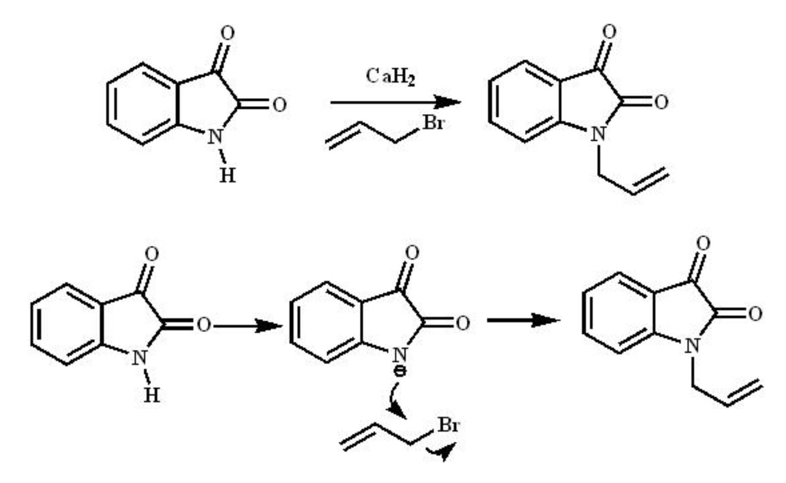

<h2>Introduction:</h2>

Isatin or 1H-indole-2,3-dione is an indole derivative. The compound was first obtained by Erdman and Laurent in 1841 as a product from the oxidation of indigo dye by chromic acids. The compound is found in many plants. N-alkylation and allylation reduces the lability of the isatin nucleus towards bases, while maintaining its typical reactivity. The N-substituted isatin have been frequently used as intermediates and synthetic precursors for the preparation of a wide variety of heterocyclic compounds.

<h2>Theory:</h2>

The SN2 reaction, also known as bimolecular nucleophilic substitution, is a type of nucleophilic substitution where a lone pair from a nucleophile attacks an electron-deficient electrophilic centre and bonds to it, expelling another group called a leaving group. Thus, the incoming group replaces the leaving group in one step. Two reacting species are involved in the slow rate-determining step of the reaction, hence the name bimolecular nucleophilic substitution.

### Mechanism

